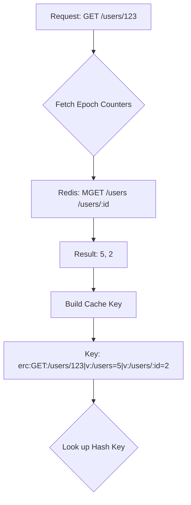
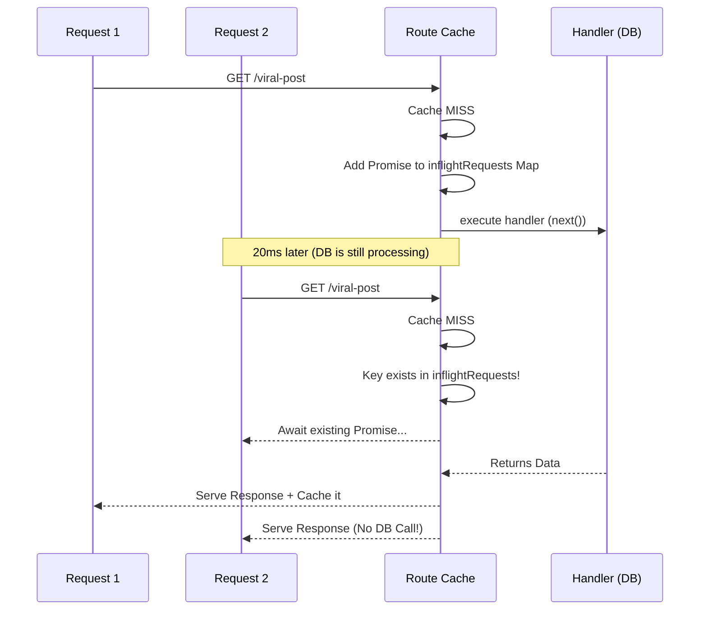

# Architecture & Design Decisions

This document outlines the core architectural choices, optimizations, and trade-offs made in `@express-route-cache`. It is meant for senior engineers and contributors who want to understand _why_ the cache works the way it does.

## 1. O(1) Epoch Invalidation

### The Problem

Traditional cache middlewares map a URL directly to a cache key (e.g., `SET /api/users/123 "{data}"`).
When a user updates their profile, the system must invalidate `/api/users/123`, `/api/users?page=1`, and potentially the generic `/api/users` list. To do this, standard libraries use the Redis `SCAN` command (or `KEYS`) followed by `DEL`. In a production database with millions of keys, iterating over keys block the event loop and severely degrades performance. Alternatively, libraries use memory-bloating `Sets` to track dependencies.

### Our Solution: Epoch Versioning

We assign an integer "epoch" counter to every route pattern (e.g., `/users` -> Epoch `1`).
This epoch is embedded directly into the generated cache key when storing data.

**Invalidation Flow:**
When `POST /users` occurs, we don't look for cache keys. We simply execute `INCR epoch:/users` to change it from `5` to `6`.
All future `/users/*` requests will now query for `v:/users=6`, causing an instant, calculated **O(1) Cache MISS**.

### Trade-offs

- **Pros:** Invalidation is instant and non-blocking. It requires zero key scanning.
- **Cons:** Cache bloat. The old data (`v:/users=5`) is abandoned in the database rather than explicitly deleted.
- **Mitigation:** This is why a Strict Eviction Policy (TTL) via `gcTime` is absolutely required. Redis handles the automated cleanup perfectly via `volatile-lru` or standard expiration mechanisms.

---

## 2. Stampede Protection (Process-Level Coalescing)

### The Problem

When a highly trafficked endpoint's cache expires, 1,000 concurrent requests might hit the Express backend before the first database query has finished repopulating the cache. Without protection, this creates a "thundering herd" or "stampede" that passes 1,000 identical queries to Postgres/MongoDB simultaneously.

### Our Solution: In-Memory Promise Maps

When a cache MISS occurs, the middleware generates the cache key and creates a pending Promise representing the Express handler's execution. It stores this Promise in an in-memory `Map`.
If subsequent requests arrive for the exact same cache key while the operation is pending, they await the _existing_ Promise instead of calling `next()`.

### Trade-offs

- **Pros:** Simple, robust, effectively neutralizes massive traffic spikes with zero external dependencies (no lock servers required).
- **Cons:** It is _process-local_. If you are running 20 Node.js pods behind a load balancer, a cold cache will trigger exactly 20 database queries (1 per pod).
- **Justification:** We opted against distributed Redis Locks (like `SET NX`) because they introduce significant failure complexity (deadlock risks, pod-crashing lock hanging) and break the "drop-in" adapter pattern, as Memory and Memcached do not natively support robust Pub/Sub lock-release notifications. 20 identical DB queries across an entire cluster is highly tolerable; 20,000 is not. Process-level coalescing solves 99% of the problem with 1% of the complexity.

---

## 3. Stale-While-Revalidate (SWR) implementation

### The Problem

Standard TTL caches create latency spikes. If data is cached for 60 seconds, the unlucky user who arrives at second 61 absorbs the full cost of the database query.

### Our Solution: Two-Tier Freshness

Inspired by TanStack Query, we maintain two timers:

1. `staleTime`: The duration the data is considered 100% fresh.
2. `gcTime`: The total duration the data is kept in the cache (`setex` TTL).

If a request arrives when the age is between `staleTime` and `gcTime`:

1. The server instantly responds with the stale `CacheEntry`.
2. The server fires an asynchronous `next()` execution in the background to revalidate the data and update the cache for the _next_ user.

### Trade-offs

- **Pros:** Near 100% perceived uptime and instant latency for end users on highly trafficked routes.
- **Cons:** "Dirty" background Express contexts. Because Express relies heavily on `res.write` and `res.end` to finish handlers, background revalidation involves intercepting these streams while simultaneously holding a "dummy" response object, which can conflict with poor downstream middleware that checks for open sockets.

---

## 4. Query Parameter Determinism (`sortQuery`)

### The Problem

`?limit=10&page=1` and `?page=1&limit=10` generate entirely different cached hashes, creating useless cache misses and database strain simply because a frontend developer appended parameters differently.

### Our Solution

If `sortQuery: true` is enabled via configuration, we extract the keys via `Object.keys()` and execute `.sort()` alphabetically before stringifying and MD5-hashing the query object. Furthermore, we intentionally strip the `req.url` base string of its search parameters (doing `url.split('?')[0]`) so only the deterministic hash dictates the cache identity.

### Trade-offs

- **Pros:** High cache hit-rates regardless of frontend framework behavior.
- **Cons:** Tiny CPU overhead (milliseconds) to sort object key Arrays on the Node.js main thread. Off by default for maximum raw throughput, recommended for public REST APIs.
