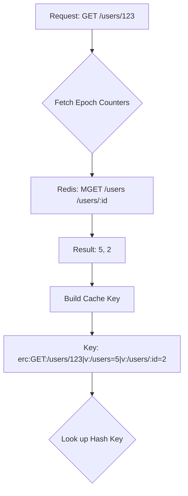
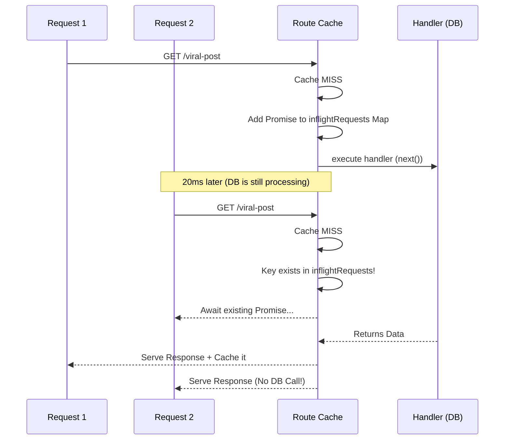

# Architecture & Design Decisions

This document outlines the core architectural choices, optimizations, and trade-offs made in `@express-route-cache`. It is meant for senior engineers and contributors who want to understand _why_ the cache works the way it does.

## 1. O(1) Epoch Invalidation

### The Problem

Traditional cache middlewares map a URL directly to a cache key (e.g., `SET /api/users/123 "{data}"`).
When a user updates their profile, the system must invalidate `/api/users/123`, `/api/users?page=1`, and potentially the generic `/api/users` list. To do this, standard libraries use the Redis `SCAN` command (or `KEYS`) followed by `DEL`. In a production database with millions of keys, iterating over keys block the event loop and severely degrades performance. Alternatively, libraries use memory-bloating `Sets` to track dependencies.

### Our Solution: Epoch Versioning

We assign an integer "epoch" counter to every route pattern (e.g., `/users` -> Epoch `1`).
This epoch is embedded directly into the generated cache key when storing data.

**Invalidation Flow:**
When `POST /users` occurs, we don't look for cache keys. We simply execute `INCR epoch:/users` to change it from `5` to `6`.
All future `/users/*` requests will now query for `v:/users=6`, causing an instant, calculated **O(1) Cache MISS**.

### Trade-offs

- **Pros:** Invalidation is instant and non-blocking. It requires zero key scanning.
- **Cons:** Cache bloat. The old data (`v:/users=5`) is abandoned in the database rather than explicitly deleted.
- **Mitigation:** This is why a Strict Eviction Policy (TTL) via `gcTime` is absolutely required. Redis handles the automated cleanup perfectly via `volatile-lru` or standard expiration mechanisms.

---

## 2. Stampede Protection (Process-Level Coalescing)

### The Problem

When a highly trafficked endpoint's cache expires, 1,000 concurrent requests might hit the Express backend before the first database query has finished repopulating the cache. Without protection, this creates a "thundering herd" or "stampede" that passes 1,000 identical queries to Postgres/MongoDB simultaneously.

### Our Solution: In-Memory Promise LRU Cache

When a cache MISS occurs, the middleware generates the cache key and creates a pending Promise representing the Express handler's execution. It stores this Promise in an in-memory `LRUCache`.
If subsequent requests arrive for the exact same cache key while the operation is pending, they await the _existing_ Promise instead of calling `next()`. (An LRU cache is specifically used here to prevent Out-Of-Memory attacks if a malicious actor sends millions of unique query parameters).

### Trade-offs

- **Pros:** Simple, robust, effectively neutralizes massive traffic spikes with zero external dependencies (no lock servers required).
- **Cons:** It is _process-local_. If you are running 20 Node.js pods behind a load balancer, a cold cache will trigger exactly 20 database queries (1 per pod).
- **Justification:** We opted against distributed Redis Locks (like `SET NX`) because they introduce significant failure complexity (deadlock risks, pod-crashing lock hanging) and break the "drop-in" adapter pattern, as Memory and Memcached do not natively support robust Pub/Sub lock-release notifications. 20 identical DB queries across an entire cluster is highly tolerable; 20,000 is not. Process-level coalescing solves 99% of the problem with 1% of the complexity.

---

## 3. Stale-While-Revalidate (SWR) implementation

### The Problem

Standard TTL caches create latency spikes. If data is cached for 60 seconds, the unlucky user who arrives at second 61 absorbs the full cost of the database query.

### Our Solution: The "Mock Response" Engine

Inspired by Next.js's Incremental Static Regeneration (ISR) and server actions, we maintain two timers:

1. `staleTime`: The duration the data is considered 100% fresh.
2. `gcTime`: The total duration the data is kept in the cache (`setex` TTL).

If a request arrives when the age is between `staleTime` and `gcTime`:

1. The server instantly responds using the real Express `res` object with the stale `CacheEntry`. The user's TCP connection is closed.
2. The middleware clones the `res` object using `Object.create()`, strips out the native network `write` and `end` bindings, and forces the HTTP `next()` chain to run in the background. 
3. Your standard database handler executes, calls `mockRes.json(data)`, and our caching layer silently intercepts that fresh data stream into Redis without throwing `ERR_HTTP_HEADERS_SENT` Socket errors.

### Trade-offs

- **Pros:** Near 100% perceived uptime and instant latency for end users, with *Zero API Changes*. Developers do not have to write special background callback functions; they just write standard Express handlers. (This is exactly how Next.js works under the hood).
- **Cons:** Background processing occupies the single-threaded Node.js event loop momentarily. Revalidating a massive payload (e.g., executing `JSON.stringify` on a 5MB array) will temporarily block synchronous operations on the main thread for a few milliseconds.

---

## 4. Query Parameter Determinism (`sortQuery`)

### The Problem

`?limit=10&page=1` and `?page=1&limit=10` generate entirely different cached hashes, creating useless cache misses and database strain simply because a frontend developer appended parameters differently.

### Our Solution

If `sortQuery: true` is enabled via configuration, we extract the keys via `Object.keys()` and execute `.sort()` alphabetically before stringifying and MD5-hashing the query object. Furthermore, we intentionally strip the `req.url` base string of its search parameters (doing `url.split('?')[0]`) so only the deterministic hash dictates the cache identity.

### Trade-offs

- **Pros:** High cache hit-rates regardless of frontend framework behavior.
- **Cons:** Tiny CPU overhead (milliseconds) to sort object key Arrays on the Node.js main thread. Off by default for maximum raw throughput, recommended for public REST APIs.

---

## 5. Large Response / Streaming Protection (`maxBodySize`)

### The Problem

If a route serves a 500MB video or a massive CSV file, loading that entire buffer into Node.js memory (`chunks.push(...)`) for caching will instantly consume the heap. If 4 users download a 500MB file simultaneously, the Node process will hit its 2GB limit and crash with a V8 OOM exception.

### Our Solution

We implemented a hard runtime size boundary (`maxBodySize`, defaulting to 2MB). As the Express request streams chunks into `res.write`, we track the cumulative length. If the size exceeds the boundary, we immediately dump the stored `chunks` to free memory and flip an `abortCaching` flag. The stream continues perfectly to the end user without attempting to buffer the gigabytes of data into Redis.
