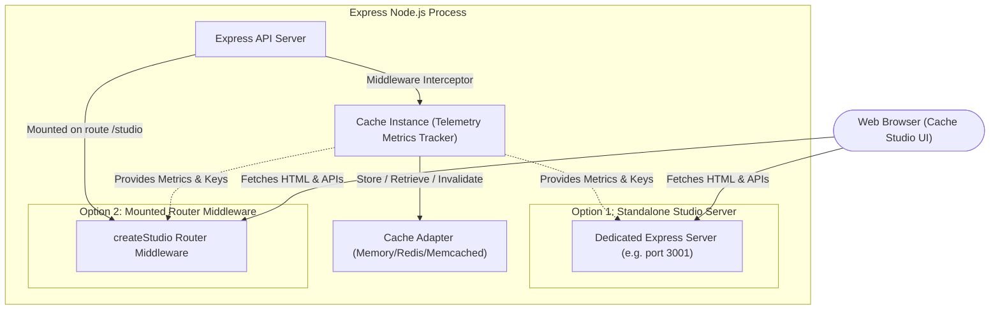
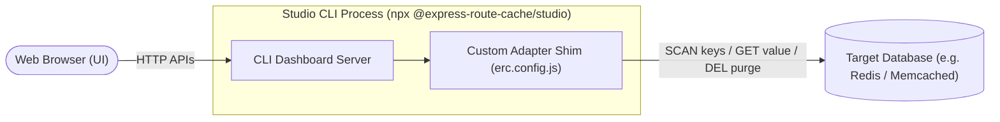

# Cache Studio 📊

Cache Studio is a premium, real-time visual dashboard package (`@express-route-cache/studio`) that lets you monitor cache hits, misses, SWR revalidations, memory usage, and scan/purge cache keys dynamically via a dark-mode web console.

---

## 📦 Installation

To use Cache Studio, install the package in your project:

```bash
npm install @express-route-cache/studio
```

---

## 📐 Architecture Overview

The following diagram illustrates how the dashboard connects to your application processes and storage layers:



---

## 🛠️ Configuration & Core Options

You can enable Cache Studio by specifying it inside the `createCache` configuration in `@express-route-cache/core`.

### Enabling Metrics Telemetry

To display charts and graphs (hits, misses, SWR execution counters), set `metrics: true`:

```ts
import { createCache, createMemoryAdapter } from "@express-route-cache/core";

const cache = createCache({
  adapter: createMemoryAdapter(),
  metrics: true, // Required: Enables real-time hit/miss counting telemetry
  studio: true, // Activates Cache Studio config reference
});
```

### Config Options (`StudioOptions`)

You can pass custom options to `studio` instead of a simple boolean:

```ts
const cache = createCache({
  adapter: createMemoryAdapter(),
  metrics: true,
  studio: {
    enabled: true,
    port: 3001, // Automatically spawns a standalone server on port 3001
    path: "/admin/cache", // Base mount path (default: '/studio')
    hostname: "0.0.0.0", // Used in the console log URL message only (see note below)
  },
});
```

| Option     | Type      | Default       | Description                                                                                                                       |
| :--------- | :-------- | :------------ | :-------------------------------------------------------------------------------------------------------------------------------- |
| `enabled`  | `boolean` | `true`        | Enable or disable the Studio.                                                                                                     |
| `port`     | `number`  | —             | If set, auto-starts a standalone Express server on this port.                                                                     |
| `path`     | `string`  | `"/studio"`   | Mount path for the dashboard.                                                                                                     |
| `hostname` | `string`  | `"localhost"` | Used **only in the console log message** to format the printed URL. It does not change the network interface the server binds to. |

When you define a `port` under `studio` options, the core cache factory **automatically spins up a standalone Express server** on that port on startup, logging the dashboard URL directly to your console:
`Cache Studio visible at --> http://localhost:3001/admin/cache`

---

## 🔌 Integration Methods

### 1. Standalone Auto-Start (Recommended)

By simply passing a `port` in the configuration, you separate the dashboard lifecycle from your main API traffic. This is perfect for production environments where you don't want to expose administration endpoints on the public API gateway.

### 2. Mounted Middleware

Mount the `createStudio` router directly inside your existing Express application:

```ts
import express from "express";
import { createCache, createMemoryAdapter } from "@express-route-cache/core";
import { createStudio } from "@express-route-cache/studio";

const app = express();
const cache = createCache({
  adapter: createMemoryAdapter(),
  metrics: true,
});

// Mount the dashboard under '/studio' prefix
app.use("/studio", createStudio({ cache }));

// Simple cached route
app.get("/api/data", cache.route({ staleTime: 60 }), (req, res) => {
  res.json({ random: Math.random() });
});

app.listen(3000, () => {
  console.log("App listening on http://localhost:3000");
  console.log("Cache Studio mounted at http://localhost:3000/studio");
});
```

> [!NOTE]
> The Studio package automatically handles trailing slash redirection (e.g. `/studio` ➔ `/studio/`) to guarantee Vite relative asset loading works flawlessly.

---

### 3. CLI Runner (`@express-route-cache/studio`)

If you want to view a production cache (like Redis or Memcached) without adding any code to your application server, you can launch it using the CLI runner:

```bash
# Runs the studio dashboard on http://localhost:5555
npx @express-route-cache/studio
```

> [!IMPORTANT]
> The binary name is `@express-route-cache/studio` (as registered in `package.json`). The CLI also respects a `PORT` environment variable to override the default port `5555`.

The CLI runner auto-detects database connections from your environment variables:

- **Redis**: Reads `REDIS_URL` or `REDIS_HOST`, `REDIS_PORT`, `REDIS_PASSWORD`
- **Memcached**: Reads `MEMCACHED_SERVERS`

#### Detailed CLI Config File (`erc.config.js`)

For custom adapters or advanced credentials, place an `erc.config.js` in your workspace root:

```javascript
// erc.config.js
const { createRedisAdapter } = require("@express-route-cache/redis");
const Redis = require("ioredis");

// Securely instantiate connection pool
const redisClient = new Redis(
  "redis://:my_secure_password@my-redis-host:6379/0",
  {
    maxRetriesPerRequest: 3,
    connectTimeout: 5000,
  },
);

module.exports = {
  adapter: createRedisAdapter({ client: redisClient }),
  metrics: true,
};
```

> [!WARNING]
> `erc.config.json` is also supported but is limited to plain JSON values (e.g. `{ "metrics": false }`). It **cannot** instantiate adapter functions — use `erc.config.js` for any real adapter configuration.

---

## 📡 Studio REST API

The Studio router exposes a small HTTP API that you can integrate with directly — useful for CI pipelines, admin scripts, or custom health dashboards.

All endpoints are mounted relative to the Studio path (e.g. if mounted at `/studio`, the keys endpoint is at `/studio/api/keys`).

| Method | Endpoint                     | Description                                                            |
| :----- | :--------------------------- | :--------------------------------------------------------------------- |
| `GET`  | `/api/status`                | Returns connection status, adapter type, and current metrics snapshot. |
| `GET`  | `/api/keys`                  | Lists all keys in the cache store.                                     |
| `GET`  | `/api/keys/detail?key=<key>` | Returns the raw and parsed value for a specific key.                   |
| `POST` | `/api/purge`                 | Deletes a single key. Body: `{ "key": "erc:hash:..." }`                |
| `POST` | `/api/purge-all`             | Deletes all keys in the cache store.                                   |

**Example: purge a key from a CI pipeline**

```bash
curl -X POST http://localhost:3001/studio/api/purge \
  -H "Content-Type: application/json" \
  -d '{"key":"erc:hash:abc123"}'
```

**Example: read metrics from a health endpoint**

```bash
curl http://localhost:3001/studio/api/status
# → { "connected": true, "adapter": "redis", "metricsEnabled": true, "metrics": { "hits": 42, ... } }
```

---

## 🌍 Universal Cache Monitoring (No Core Dependency)

Because the Cache Studio UI and API routes are decoupled from the core middleware lifecycle, you can use `@express-route-cache/studio` as a **generic visual database client / cache monitor** for any storage instance (like direct Redis sessions, Memcached queues, or custom memory layers)—even if you are not using our cache middleware in your application!



### Writing a Custom Adapter Shim

To monitor a custom store, write an `erc.config.js` and implement the three required methods (`keys`, `get`, `del`) to map to your database driver:

```javascript
// erc.config.js
const Redis = require("ioredis");

// Initialize your direct redis client
const redisClient = new Redis({
  host: "127.0.0.1",
  port: 6379,
});

redisClient.on("error", (err) => console.error("Redis Connection Error:", err));

module.exports = {
  // Custom adapter shim connects our UI to your raw database instance
  adapter: {
    // 1. Tell the UI how to get the list of keys (supporting pattern search)
    keys: async () => {
      // In this example, we scan session keys only
      return redisClient.keys("session:*");
    },

    // 2. Retrieve a key's raw value (or JSON representation)
    get: async (key) => {
      const val = await redisClient.get(key);
      if (!val) return null;
      return val;
    },

    // 3. Delete key if purged on the dashboard
    del: async (key) => {
      await redisClient.del(key);
    },
  },
  metrics: false, // Disables route caching telemetry charts since we're not monitoring middleware
};
```

Run `npx @express-route-cache/studio` in the folder containing this config file, and you get an instant visual admin console for your database sessions!
