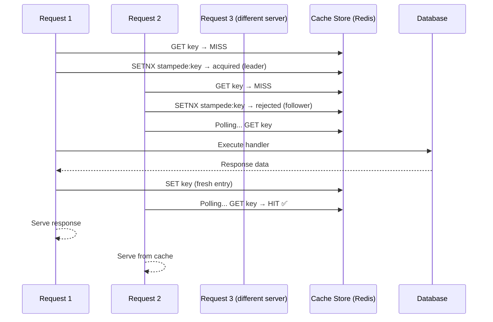

# Stampede Protection

A "Cache Stampede" (also known as the "Thundering Herd" problem) occurs when a popular cache entry expires and hundreds of concurrent requests hit your database simultaneously to refresh it.

## Two-Tier Request Coalescing

`@express-route-cache` prevents this with a **two-tier coalescing system** that works both per-process and across distributed servers.

### Tier 1: Distributed Lock (Redis / Memcached)

When your adapter implements the optional `setNX` method (both the Redis and Memcached adapters do), the library elects a single **leader server** across your entire cluster:

1. **First server** to receive a cold-cache request calls `setNX` to acquire a distributed lock.
2. **All other servers** detect the lock is held and poll the cache store at 150ms intervals (up to 10 attempts ≈ 1.5s) waiting for the leader to populate the entry.
3. **Once populated**, the followers read the fresh entry from the cache and serve it — no extra DB queries.
4. If the leader fails or polling times out, the follower falls through to run the handler itself as a safety valve.

#### Lock TTL & Crash Recovery

The stampede lock TTL is set to `staleTime + gcTime + 30` seconds. For example, with `staleTime: 60, gcTime: 300`, the lock lives for **390 seconds** in Redis.

This means:
- If the **leader completes normally**, it explicitly deletes the lock key so followers can proceed immediately.
- If the **leader crashes** before populating the cache, followers poll for up to ~1.5s then fall through and run the handler themselves — guaranteeing eventual response at the cost of one extra handler execution per follower.
- The long TTL is a safety net to prevent the lock from lingering indefinitely after an unexpected process exit.

### Tier 2: Local In-Process Lock (all adapters)

Within a single Node.js process, an LRU map (`inflightRequests`) coalesces concurrent requests for the same key:

1. **First request** hits a cache MISS. It starts executing the Express handler and stores a **Promise** in the in-process map.
2. **Subsequent requests** for the same key await the existing Promise instead of starting a new handler execution.
3. **Completion**: Once the first request finishes, all waiting requests resolve with the same cached entry simultaneously.



## Configuration

Stampede protection is **enabled by default**. You can toggle it if needed:

```ts
const cache = createCache({
  stampede: true, // Default
});
```

> [!NOTE]
> Tier 1 (distributed locking) activates automatically when your adapter implements `setNX` (Redis, Memcached). For the Memory adapter, only Tier 2 (in-process) protection is active.
