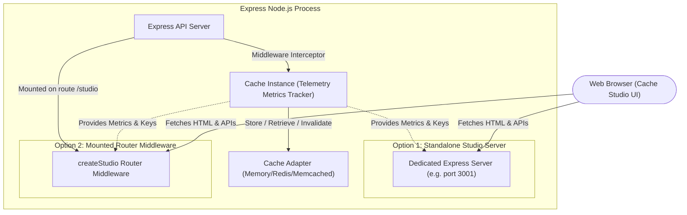
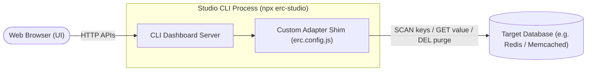

# @express-route-cache/studio 📊

Cache Studio is a premium, real-time visual dashboard and CLI tool for `@express-route-cache`. It enables dark-themed analytics and key management (scanning, details, and purging) for in-memory, Redis, and Memcached cache stores.

---

## 📦 Installation

```bash
npm install @express-route-cache/studio
```

---

## 📐 Architecture Overview



---

## 🛠️ Usage & Integration Options

### 1. Standalone Auto-Start (Zero Code)
Add a `port` inside the `studio` configuration of `@express-route-cache/core`. It will automatically spin up a dedicated dashboard server on that port during startup:

```ts
import { createCache, createMemoryAdapter } from "@express-route-cache/core";

const cache = createCache({
  adapter: createMemoryAdapter(),
  metrics: true, // Required: Enables real-time charts/telemetry
  studio: {
    port: 3001,  // Auto-starts standalone dashboard server
    path: "/studio", // Mount path
    hostname: "localhost"
  }
});
```

Console output on startup:
`Cache Studio visible at --> http://localhost:3001/studio`

---

### 2. Express Middleware Mount
Mount the `createStudio` router directly inside your existing main Express application:

```ts
import express from "express";
import { createCache, createMemoryAdapter } from "@express-route-cache/core";
import { createStudio } from "@express-route-cache/studio";

const app = express();
const cache = createCache({
  adapter: createMemoryAdapter(),
  metrics: true,
});

// Mount the dashboard under `/studio` prefix
app.use("/studio", createStudio({ cache }));

app.listen(3000, () => {
  console.log("App listening on http://localhost:3000");
  console.log("Cache Studio mounted at http://localhost:3000/studio");
});
```

Visiting `http://localhost:3000/studio` will dynamically resolve backend APIs relative to the current URL.

---

### 3. CLI Runner (`express-route-cache-studio`)
Monitor a production cache instance without modifying your server application code.

Run the global CLI command:
```bash
# Starts dashboard on http://localhost:5555
npx express-route-cache-studio
```

The CLI runner auto-detects database connections from your environment variables:
- **Redis**: Reads `REDIS_URL` or `REDIS_HOST`, `REDIS_PORT`, `REDIS_PASSWORD`
- **Memcached**: Reads `MEMCACHED_SERVERS`

#### CLI Configuration (`erc.config.js`)
Create a file named `erc.config.js` or `erc.config.json` in your workspace root to define custom adapters or credentials:

```javascript
const { createRedisAdapter } = require("@express-route-cache/redis");

module.exports = {
  adapter: createRedisAdapter({
    url: "redis://127.0.0.1:6379",
  }),
  metrics: true,
};
```

---

## 🌍 Universal Cache Monitoring (No Core Dependency)

You can use the Studio package to monitor **any generic cache or database instance** (e.g. raw Redis key-value pairs, session stores, Memcached queues) without using the `@express-route-cache/core` middleware in your routes.



Write an `erc.config.js` with an adapter shim matching your data layout:

```javascript
const Redis = require("ioredis");
const redisClient = new Redis("redis://127.0.0.1:6379");

module.exports = {
  adapter: {
    // 1. Tell the UI how to get the list of keys
    keys: async () => redisClient.keys("sessions:*"),
    
    // 2. Retrieve a key's raw value (or JSON representation)
    get: async (key) => redisClient.get(key),
    
    // 3. Delete key if purged on the dashboard
    del: async (key) => redisClient.del(key),
  },
  metrics: false, // Disables route caching telemetry charts
};
```

Run `npx express-route-cache-studio` and visit the dashboard to manage your keys visually!
